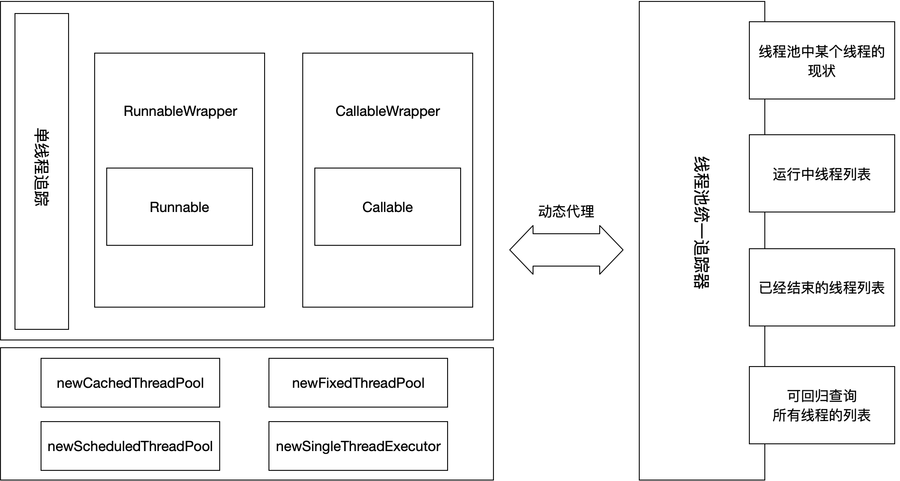
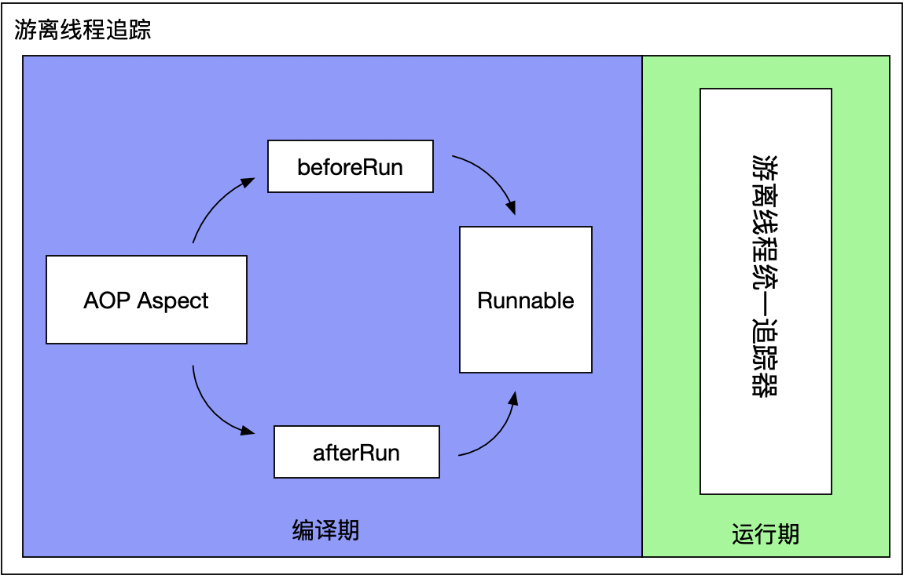
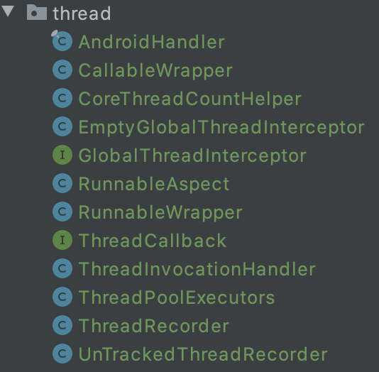

# 可追踪线程池库

## 问题

* 大量的线程创建、执行和销毁是非常耗cpu和内存的，这样将直接影响系统的吞吐量，导致性能急剧下降，如果内存资源占用的比较多，还很可能造成OOM
* 大量的线程的创建和销毁很容易导致GC频繁的执行，从而发生内存抖动现象，而发生了内存抖动，对于移动端来说，最大的影响就是造成界面卡顿
* 线程的创建和销毁都需要时间，当有大量的线程创建和销毁时，那么这些时间的消耗则比较明显，将导致性能上的缺失
* 使用start()方法启动线程，该线程会在run()方法结束后，自动回收该线程。虽然如此，在某些场景中线程业务的处理速度完全达不到我们的要求，系统中的线程会逐渐变大，进而消耗CPU资源，大量的线程抢占宝贵的内存资源，可能还会出现OOM，即便没有出现，大量的线程回收也会个GC带来很大的压力。

## 初版方案



但是对于没有用上面的线程池库的地方怎么办呢？



项目工程：



## 使用示例

```java
package com.panda.college.libbase

import androidx.test.ext.junit.runners.AndroidJUnit4
import com.panda.college.libbase.thread.GlobalThreadInterceptor
import com.panda.college.libbase.thread.ThreadCallback
import com.panda.college.libbase.thread.ThreadPoolExecutors
import org.junit.Before
import org.junit.Test
import org.junit.runner.RunWith

/**
 *
 * @author panda
 * created at 2021/3/9 10:05 PM
 */
@RunWith(AndroidJUnit4::class)
class ThreadTest {
    lateinit var executors: ThreadPoolExecutors

    @Before
    fun init() {
        executors = ThreadPoolExecutors.PoolBuilder
                .createFixed(5)
                .setInterceptor(object : GlobalThreadInterceptor {
                    override fun onStart(threadTag: String, thread: Thread) {
                        println(thread.name + " onStart...")
                    }

                    override fun onEnd(threadTag: String, thread: Thread) {
                        println(thread.name + " onEnd...")
                    }
                })
                .build()
    }

    @Test
    fun test() {
        executors
                .setThreadTag("test")
                .setThreadCallback(object : ThreadCallback {
            override fun onError(thread: Thread, msg: String, t: Throwable) {
                println("onError...")
            }

            override fun onCompleted(thread: Thread) {
                println("onCompleted...")
            }

            override fun onStart(thread: Thread) {
                println("onStart...")
            }
        }).execute { println("do something...") }
    }
}
```
